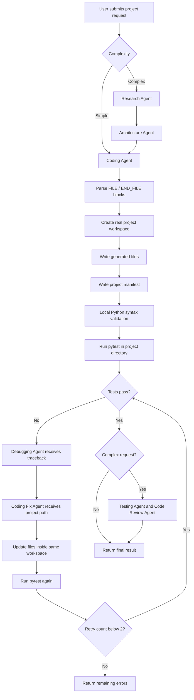

# AI Multi-Agent Software Development Platform

## 1. Project Purpose

This project uses multiple CrewAI agents to turn a natural-language software request into a generated software project. The platform can:

- Research a complex request.
- Produce an architecture proposal.
- Generate frontend and backend source files.
- Parse structured coding output.
- Create a real project workspace on disk.
- Create a project manifest.
- Run local `pytest` tests against the generated workspace.
- Send real test output to the Debugging Agent when tests fail.
- Apply Coding Fix Agent output back into the generated workspace.
- Retry testing up to two times.
- Run code review and optional manager review.
- Package the generated project as a ZIP download.

The existing simple/complex routing is preserved.

## 2. Technology Stack

### Backend

- Python
- FastAPI
- Uvicorn
- CrewAI
- Pydantic
- Pytest

### Frontend

- React
- Vite
- Axios
- React Syntax Highlighter
- ESLint

### Storage

Generated projects are stored locally under:

```text
generated_projects/<project_name>/
```

No database, Git integration, Docker/E2B, or deployment integration is currently used.

## 3. Repository Structure

```text
.
├── app/
│   ├── __init__.py
│   ├── main.py
│   ├── agents/
│   │   ├── architecture_agent.py
│   │   ├── code_review_agent.py
│   │   ├── coding_agent.py
│   │   ├── debugging_agent.py
│   │   ├── manager_agent.py
│   │   ├── research_agent.py
│   │   └── testing_agent.py
│   ├── api/
│   │   └── routes.py
│   ├── config/
│   │   └── llm_config.py
│   ├── crew/
│   │   └── crew_setup.py
│   ├── tasks/
│   │   ├── architecture_task.py
│   │   ├── code_review_task.py
│   │   ├── coding_fix_task.py
│   │   ├── coding_task.py
│   │   ├── debugging_task.py
│   │   ├── manager_task.py
│   │   ├── research_task.py
│   │   └── testing_task.py
│   └── utils/
│       ├── file_parser.py
│       ├── project_writer.py
│       ├── test_runner.py
│       └── validation.py
├── frontend/
│   ├── package.json
│   ├── index.html
│   └── src/
│       ├── App.jsx
│       ├── App.css
│       ├── index.css
│       └── main.jsx
├── generated_projects/
├── requirements.txt
└── PROJECT_DOCUMENTATION.md
```

## 4. Agent Responsibilities

| Agent | Responsibility |
|---|---|
| Research Agent | Researches complex project requirements. |
| Architecture Agent | Produces the technical architecture for complex requests. |
| Coding Agent | Generates new project files or corrected files. |
| Testing Agent | Performs LLM-based analysis of generated code for complex requests. |
| Debugging Agent | Diagnoses failures using validation results and real pytest output. |
| Coding Fix Agent | Returns corrected files for the generated project. |
| Code Review Agent | Reviews generated code after successful complex-project tests. |
| Manager Agent | Provides an optional manager review when requested. |

No new agents were added for project generation or self-healing.

## 5. Main API Endpoints

### `POST /run-company`

Starts the software generation workflow.

Request body:

```json
{
  "project_request": "Build a full-stack task manager",
  "complexity": "auto",
  "review": false
}
```

Accepted complexity values:

- `auto`
- `simple`
- `complex`

### `GET /projects/{project_id}/download`

Creates and downloads a ZIP archive of a generated project, including its manifest.

Example:

```text
GET /projects/build-a-task-manager-a1b2c3d4/download
```

### `GET /`

Returns the backend health message:

```json
{
  "message": "AI Software Company Running"
}
```

## 6. Complexity Routing

Complexity is selected from the request unless explicitly supplied.

### Simple request

```text
Coding Agent
→ File Parser
→ Workspace Manager
→ Manifest
→ Local Validation
→ Pytest
→ Self-Healing if needed
→ Final Response
```

### Complex request

```text
Research Agent
→ Architecture Agent
→ Coding Agent
→ File Parser
→ Workspace Manager
→ Manifest
→ Local Validation
→ Pytest
→ Testing Agent analysis
→ Self-Healing if needed
→ Code Review Agent
→ Optional Manager Agent
→ Final Response
```

`MAX_RETRIES` remains `2`.

## 7. Real Project File Generation

### Coding output contract

The Coding Agent and Coding Fix Agent must return complete files using this exact structure:

```text
FILE: frontend/src/App.jsx
import React from "react";

export default function App() {
    return <h1>Hello</h1>;
}
END_FILE

FILE: backend/main.py
from fastapi import FastAPI

app = FastAPI()
END_FILE
```

The parser ignores text outside complete `FILE` and `END_FILE` blocks. An unterminated block is ignored.

### Parser

`app/utils/file_parser.py`:

- Detects every complete file block.
- Extracts the relative file path.
- Extracts the exact file content.
- Supports multiple files.
- Ignores explanations and invalid text.

### Workspace manager

`app/utils/project_writer.py`:

- Creates a unique project name from the request plus a unique suffix.
- Creates `generated_projects/<project_name>/`.
- Creates nested directories automatically.
- Writes generated content with UTF-8 encoding.
- Creates `project_manifest.json`.
- Updates the same project directory after a Coding Fix Agent retry.
- Creates ZIP archives for download.

## 8. Path Security

Generated paths are checked before writing.

Rejected paths include:

```text
../escape.py
../../outside.py
C:\outside.py
/var/tmp/outside.py
\\server\share\outside.py
```

Only paths inside the generated project directory are accepted. The workspace manager resolves the final destination and confirms it remains inside the project directory before writing.

## 9. Project Manifest

Every generated workspace contains:

```text
generated_projects/<project_name>/project_manifest.json
```

Example:

```json
{
  "project_name": "build-a-task-manager-a1b2c3d4",
  "generated_files": [
    "frontend/src/App.jsx",
    "backend/main.py"
  ],
  "file_paths": [
    "frontend/src/App.jsx",
    "backend/main.py"
  ],
  "language": "JavaScript, Python",
  "framework": "JavaScript frontend",
  "generated_at": "2026-09-03T12:00:00+00:00"
}
```

The framework field is inferred from available project files or architecture output when available.

## 10. Self-Healing Workflow



### Test execution

`app/utils/test_runner.py` runs:

```text
python -m pytest -q --tb=long
```

The command runs with the generated project directory as its working directory. It returns:

- `PASS` when pytest exits with code `0`.
- `FAIL` when pytest exits with a failure code.
- `NO_TESTS` when pytest exits with code `5`.

The captured stdout and stderr are preserved. Failures and tracebacks are sent to the Debugging Agent.

### Fix behavior

When tests fail:

1. The Debugging Agent receives the real pytest output.
2. The Coding Fix Agent receives the debugging report and generated project path.
3. The Coding Fix Agent returns corrected `FILE` blocks.
4. The parser extracts the corrected files.
5. The workspace manager writes them into the existing generated project directory.
6. The manifest is regenerated.
7. Pytest runs again.
8. The process stops after two fix attempts.

## 11. API Result Fields

The generation endpoint returns the existing agent output plus project and self-healing details:

```json
{
  "status": "success",
  "complexity": "complex",
  "test_status": "PASS",
  "test_attempts": [
    {
      "status": "FAIL",
      "return_code": 1,
      "output": "...real pytest traceback..."
    },
    {
      "status": "PASS",
      "return_code": 0,
      "output": "..."
    }
  ],
  "fixes_applied": [
    {
      "attempt": 1,
      "files": ["backend/main.py"]
    }
  ],
  "remaining_errors": "",
  "retry_count": 1,
  "project_name": "build-a-task-manager-a1b2c3d4",
  "project_path": ".../generated_projects/build-a-task-manager-a1b2c3d4",
  "generated_files": [
    "frontend/src/App.jsx",
    "backend/main.py"
  ],
  "file_count": 2,
  "manifest_path": ".../project_manifest.json",
  "generation_status": "success"
}
```

## 12. Frontend Behavior

The React frontend:

1. Sends the request to `http://127.0.0.1:8000/run-company`.
2. Displays research, architecture, code, testing, debugging, validation, and review output.
3. Displays real test status, test attempt count, fixes applied, and remaining errors in the Validation tab.
4. Displays the generated project directory in the Files tab.
5. Provides a ZIP download link for the generated project.

The frontend does not execute generated tests. Test execution happens in the backend workspace.

## 13. LLM Call Boundaries

### LLM-consuming operations

- Research Agent.
- Architecture Agent.
- Coding Agent.
- Testing Agent analysis.
- Debugging Agent.
- Coding Fix Agent.
- Code Review Agent.
- Optional Manager Agent.

### Local operations with no LLM call

- Complexity detection.
- FILE block parsing.
- Path-security checks.
- Directory creation.
- File writing.
- Manifest generation.
- Python syntax validation.
- Pytest execution.
- ZIP creation.
- API response construction.

## 14. Running the Project

From the repository root, start the backend:

```powershell
.\venv\Scripts\python.exe -m uvicorn app.main:app --reload --host 127.0.0.1 --port 8000
```

In a second terminal, start the frontend:

```powershell
cd frontend
npm run dev -- --host 127.0.0.1 --port 5173
```

Open:

```text
http://127.0.0.1:5173/
```

The backend API is available at:

```text
http://127.0.0.1:8000/
```

## 15. Validation Commands

Backend compilation:

```powershell
.\venv\Scripts\python.exe -m compileall -q app
```

Frontend lint:

```powershell
cd frontend
npm run lint
```

Frontend production build:

```powershell
npm run build
```

Real generated-project tests require `pytest`, which is declared in `requirements.txt`.

## 16. Current Scope Exclusions

The platform intentionally does not currently include:

- New AI agents.
- Docker or E2B sandboxing.
- Git repositories or commits for generated projects.
- Deployment automation.
- Database persistence for project history.
- Automatic installation of generated project dependencies.
- Execution of frontend JavaScript test frameworks.

These can be considered later without changing the current generation contract.
